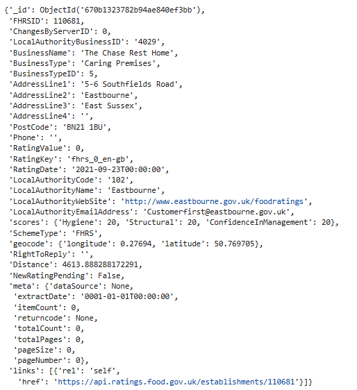

# NOSQL-CHALLENGE

## Website: 
[website](https://github.com/Rock-Roll1968/NOSQL-CHALLENGE.git)

## Description
NOSQL analysis of UK Restaurant food hygiene ratings 

## Table of Contents
- [Installation](#installation)
- [Usage](#usage)
- [Credits](#credits)
- [License](#license)
- [Features](#features)

- [Contact](#contact)

## Installation
MongoDB, PyMongo, Pretty Print, Pandas, Jupyter Notebook, REGEX

## Usage
Run ipynb files

## Credits
Ernesto Garcia

## License
MIT

## Features
MongoDB database import with collection manipulation and aggregation analysis

## Contact
If there are any questions or concerns, I can be reached at:
##### [github: ROCK-ROLL1968](https://github.com/ROCK-ROLL1968)
##### [email: ernesto.v.garcia@outlook.com](mailto:ernesto.v.garcia@outlook.com)
